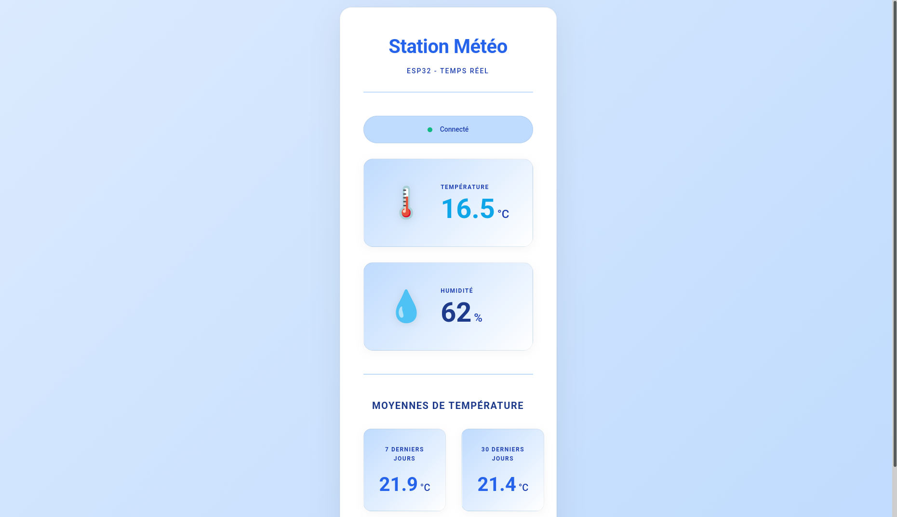
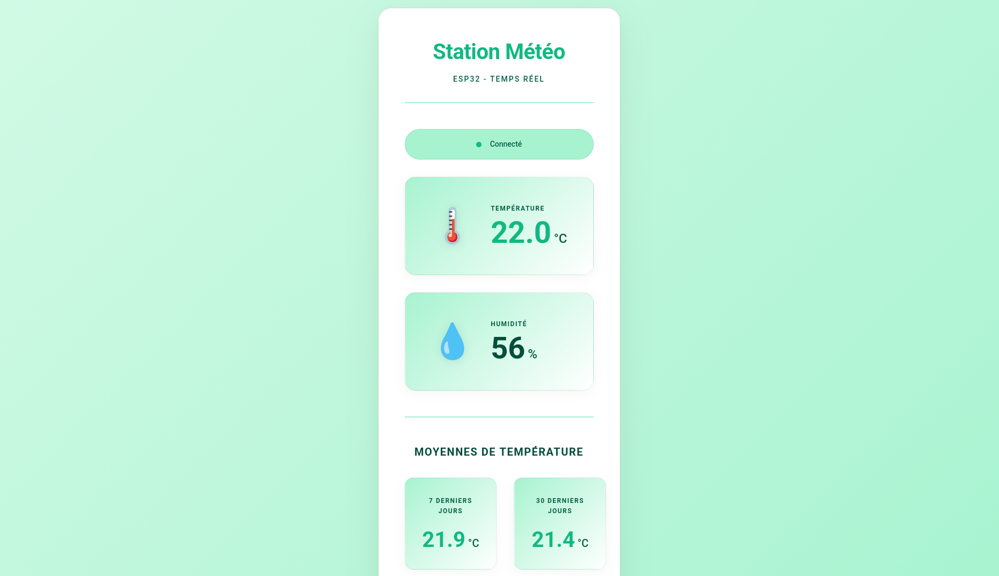
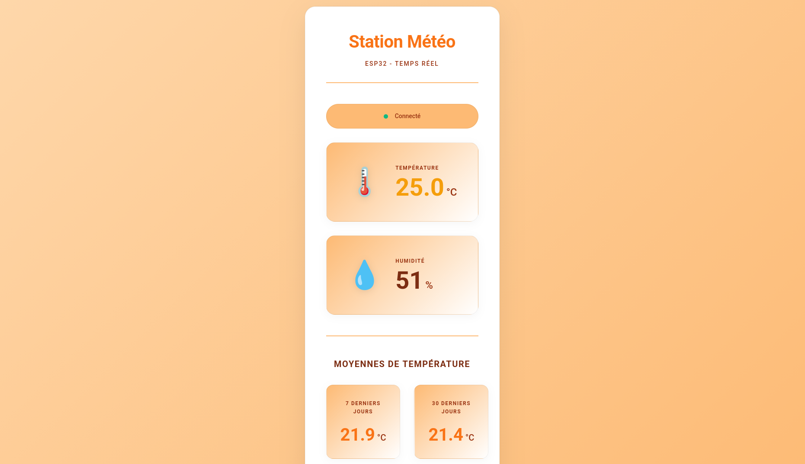
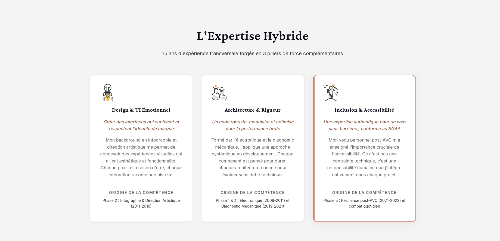

# 🌡️ Station Météo ESP32

Station météorologique connectée avec interface web moderne et palette de couleurs dynamique selon la température.

> **🚀 Nouveau ?** Consultez le [Guide de Démarrage Rapide](QUICKSTART.md) pour une installation en 10 minutes !

## 📋 Vue d'ensemble

Ce projet combine un ESP32 avec un capteur DHT22 pour mesurer la température et l'humidité en temps réel. Les données sont affichées localement sur un écran OLED et transmises via MQTT vers une infrastructure complète (InfluxDB, API, interface web).

### Caractéristiques principales

- **Palette dynamique** : L'interface change de couleur selon la température (bleu/vert/orange/rouge)
- **Graphiques historiques** : Moyennes sur 7 et 30 jours
- **Architecture modulaire** : Code organisé selon le principe SRP
- **Design responsive** : Adapté mobile et desktop
- **Accessible** : Contrastes WCAG AA

## 🛠️ Matériel Requis

- ESP32 DevKit v1
- Capteur DHT22 (température et humidité)
- Écran OLED SSD1306 128x64 (I2C)
- Breadboard et câbles de connexion
- Résistance 10kΩ (pull-up pour DHT22, optionnel)

## 🔌 Câblage

```
ESP32 GPIO 4  → DHT22 DATA
ESP32 GPIO 21 → OLED SDA
ESP32 GPIO 22 → OLED SCL
ESP32 3.3V    → DHT22 VCC + OLED VCC
ESP32 GND     → DHT22 GND + OLED GND
```

## 📦 Prérequis Logiciels

- **PlatformIO** (pour compiler et téléverser le code ESP32)
- **Docker** et **Docker Compose** (pour l'infrastructure)
- **htpasswd** (optionnel, pour l'authentification web)

## 🚀 Installation Complète

### Étape 1 : Cloner le Projet

```bash
git clone https://github.com/VOTRE_USERNAME/Station_meteo.git
cd Station_meteo
```

### Étape 2 : Configuration ESP32

1. Créer le fichier de configuration :
```bash
cp include/config.h.example include/config.h
```

2. Éditer `include/config.h` avec vos paramètres :
```cpp
#define WIFI_SSID "VotreSSID"              // Nom de votre réseau WiFi
#define WIFI_PASSWORD "VotreMotDePasse"    // Mot de passe WiFi
#define MQTT_BROKER "192.168.1.100"        // IP de votre serveur (où tourne Docker)
```

3. Compiler et téléverser :
```bash
pio run --target upload
```

### Étape 3 : Configuration Infrastructure

1. Créer le fichier Telegraf :
```bash
cp telegraf.conf.example telegraf.conf
```

2. Lancer l'infrastructure Docker :
```bash
docker-compose up -d
```

3. Accéder à InfluxDB pour récupérer le token :
   - Ouvrir `http://localhost:8086`
   - Se connecter avec `admin_meteo` / `VOTRE_MOT_DE_PASSE` (défini dans docker-compose.yml)
   - Aller dans **Data** → **API Tokens**
   - Copier le token

4. Éditer `telegraf.conf` avec le token :
```toml
token = "VOTRE_TOKEN_COPIE"
organization = "VOTRE_ORGANISATION"
```

5. Redémarrer Telegraf :
```bash
docker-compose restart telegraf
```

### Étape 4 : Accès à l'Interface

- **Interface web** : `http://localhost` ou `http://IP_SERVEUR`
- **API** : `http://localhost:8000`
- **InfluxDB** : `http://localhost:8086`

## 📖 Documentation Détaillée

Consultez les guides complets :
- **[SETUP.md](SETUP.md)** - Guide de configuration pas à pas
- **[CONFIGURATION.md](CONFIGURATION.md)** - Détails de configuration
- **[src/README.md](src/README.md)** - Code ESP32
- **[frontend/README.md](frontend/README.md)** - Interface web
- **[api/README.md](api/README.md)** - API REST
- **[mqtt/README.md](mqtt/README.md)** - Configuration MQTT

## 🔧 Dépannage

### L'ESP32 ne se connecte pas au WiFi
- Vérifier le SSID et mot de passe dans `config.h`
- Vérifier que le réseau est en 2.4GHz (l'ESP32 ne supporte pas le 5GHz)
- Consulter le moniteur série : `pio device monitor`

### Pas de données dans l'interface web
- Vérifier que l'ESP32 est connecté (voir écran OLED)
- Vérifier les logs Docker : `docker logs telegraf`
- Vérifier que le token InfluxDB est correct dans `telegraf.conf`

### L'interface web ne charge pas
- Vérifier que tous les conteneurs sont démarrés : `docker-compose ps`
- Vérifier les logs : `docker logs weather_app`
- Vérifier l'IP dans `frontend/public/config.js`

## 📁 Structure du Projet

- `src/` - Code ESP32 (C++)
- `include/` - Headers et configuration
- `frontend/` - Interface web
- `api/` - API Python FastAPI
- `mqtt/` - Configuration MQTT
- `docker-compose.yml` - Infrastructure complète

## 📊 Stack Technique

- **Firmware** : C++ (Arduino Framework)
- **API** : Python FastAPI
- **Base de données** : InfluxDB 2.7
- **Frontend** : JavaScript ES6, Chart.js
- **MQTT** : Eclipse Mosquitto
- **Conteneurisation** : Docker

## 📸 Captures d'Écran

### Interface Principale - Palettes Dynamiques

**Palette Bleue (< 18°C) - Froid**



**Palette Verte (18-25°C) - Confort**



**Palette Orange (25-30°C) - Chaud**



**Palette Rouge (> 30°C) - Canicule**


### Graphiques Historiques

**Moyennes sur 7 et 30 jours**



## 📖 Documentation

Consultez les README dans chaque dossier pour plus de détails :
- [src/](src/README.md) - Code ESP32
- [frontend/](frontend/README.md) - Interface web
- [api/](api/README.md) - API REST
- [mqtt/](mqtt/README.md) - Configuration MQTT

## ⚙️ Configuration Avancée

### Authentification Web

Pour protéger l'interface web avec un mot de passe :

```bash
cp frontend/.htpasswd.example frontend/.htpasswd
htpasswd -c frontend/.htpasswd VOTRE_UTILISATEUR
```

### Authentification MQTT

Pour sécuriser le broker MQTT, consultez [mqtt/README.md](mqtt/README.md)

### Personnalisation des Seuils

Modifier les seuils de température dans `frontend/public/themeManager.js` :

```javascript
if (temp < 18) theme = 'cold';        // Bleu
else if (temp < 25) theme = 'comfort'; // Vert
else if (temp < 30) theme = 'warm';    // Orange
else theme = 'hot';                    // Rouge
```

## 🔒 Sécurité

### Fichiers Sensibles

Ces fichiers contiennent des données sensibles et sont exclus de Git :
- `include/config.h` - Identifiants WiFi/MQTT
- `telegraf.conf` - Token InfluxDB
- `frontend/.htpasswd` - Mots de passe web

**Ne jamais commiter ces fichiers !**

### Recommandations Production

- Activer l'authentification MQTT
- Utiliser HTTPS pour l'interface web
- Changer les mots de passe par défaut
- Restreindre les CORS dans l'API
- Utiliser des tokens InfluxDB avec permissions limitées

## 📝 Licence

MIT License - Voir [LICENSE](LICENSE)

## 🙏 Remerciements

Projet développé avec les bibliothèques Adafruit, Chart.js, InfluxDB et Eclipse Mosquitto.